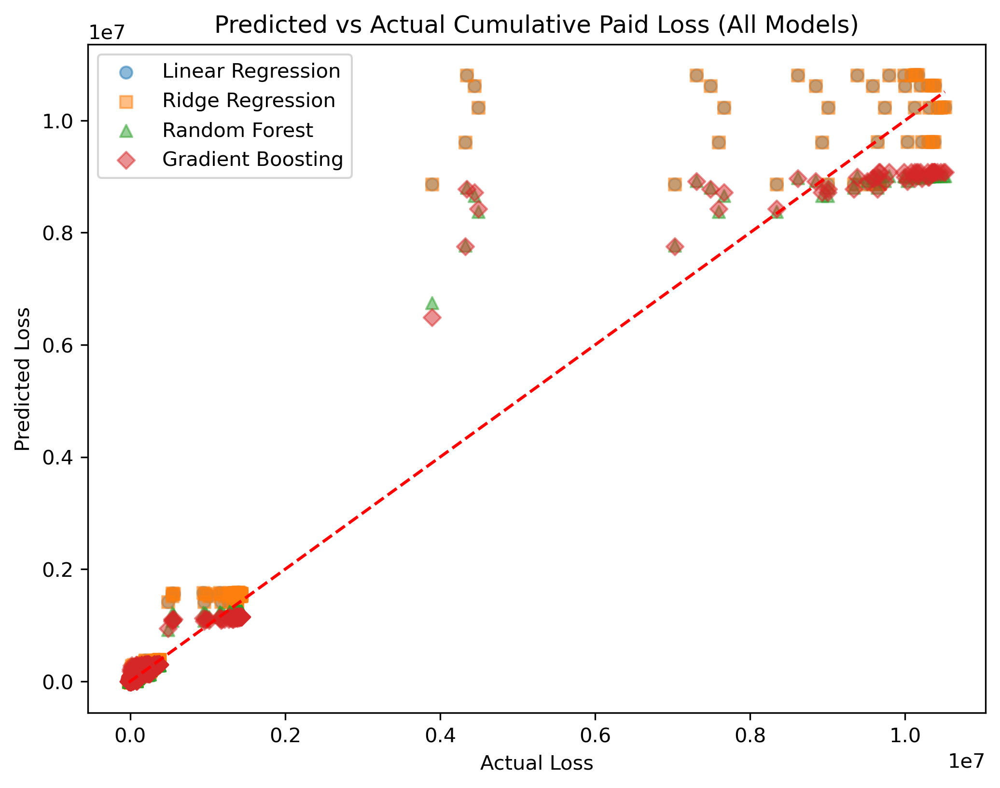

# Enhancing Loss Reserving with Predictive Analytics: Linear vs Ensemble models

## NON-TECHNICAL EXPLANATION OF YOUR PROJECT
This project looks at how to better predict insurance claim costs over time. It compares simple models with more complex ones to see which gives the most reliable results. The findings show that the simpler models not only predict more accurately but are also easier to explain. This makes them especially useful for setting aside the right amount of money for future claims and for making stronger decisions about how to manage financial risk.

## DATA
This project uses the CAS Loss Reserve Database (LRD), a publicly available dataset provided by the Casualty Actuarial Society (CAS). The LRD contains industry‑standard insurance claims development triangles, including accident year, development year, earned premiums, incurred losses, and cumulative paid losses across multiple lines of business.
I selected this the dataset is widely used in actuarial research and model benchmarking because it provides a consistent, structured view of claims development over time.
Citation:
- Barnett, G., Zehnwirth, B., & the Casualty Actuarial Society (CAS). Loss Reserve Database (LRD). Casualty Actuarial Society. Available at: https://www.casact.org/publications-research/research/research-resources/loss-reserving-data-pulled-naic-schedule-p

## MODEL 
This project tests a few different approaches to predicting cumulative paid loss: Linear Regression, Ridge Regression, Random Forest, and Gradient Boosting. Linear and Ridge were chosen as baselines because they are straightforward, easy to explain, and a good fit when the data follows mostly linear patterns. Random Forest and Gradient Boosting were added to see if more flexible, non‑linear methods could uncover extra structure. Tuning only improved them slightly.

## HYPERPARAMETER OPTIMSATION
Random forest and Gradient boosting were the hyperparameters that I chose to optimise. In order to do this, I used Bayesian Optimisation. This searches the parameter space more efficiently than grid or random search by learning from past trials. Cross‑validation on the training set was used to evaluate candidate parameter sets, and the best configuration was then tested on the held‑out data.
However, the untuned Gradient boosting was the best performer in the model with - MSE ~56.6k, MAE ~3.9k, R2 ~0.971 which implies that the standard defaults were optimal.
## RESULTS
With Accident Year, Development Year, and Earned Premium as inputs, the data shows non‑linear development patterns in losses. Linear models do not capture this well, while Gradient Boosting provides the most reliable fit, making it the preferred choice for predicting cumulative paid loss in this setup.
Therefore we cannot just assume with high earned premiums results in more claims. More factors must be taken into account.

*Figure 1: Predicted vs Actual Cumulative Paid Loss across four models.*

